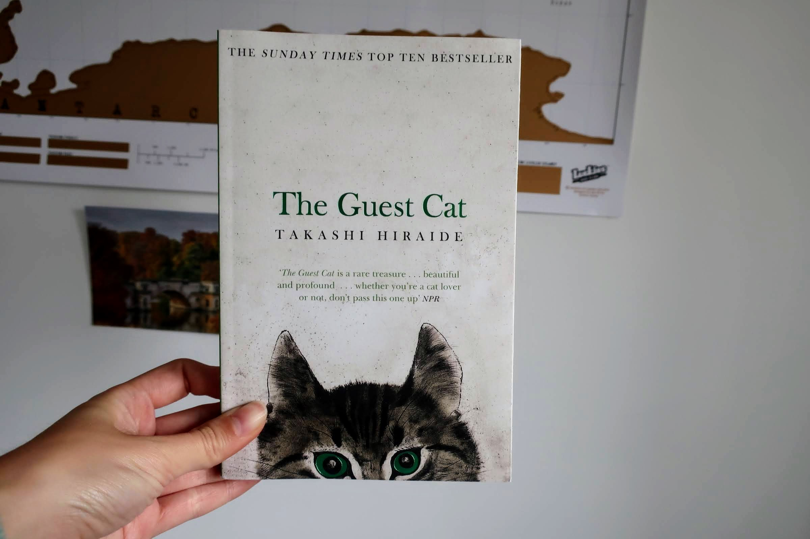

**Does typography have an age?** *The Guest Cat* might sound like a book for children, but the typography tells us that it is in fact a literary fiction book for adults. How can the font of a book title tell us so much? And can we trust our instincts when it comes to judging genres of books based on the typography of the title? Let's find out! 

### Title and design - do they match?

This edition of *The Guest Cat* by Takashi Hirade was published in 2014 by Picador, an imprint of Pan Macmillan. It is a short novel translated from Japanese about a quiet married couple in the suburbs of Tokyo who gets a visit from one of the cats of the neighbourhood. Does the story's premise match the typography on the cover? I think it does.  

It is not a story for children, as one might have presumed if they only *heard* the title without actually seeing the book. If the typography had been handdrawn and a bit more playful, I think a lot of people would have bought it for their kids by mistake. If they didn't do the proper research, that is. So what did the designer do to make it look more adult and sophisticated?

We judge a book by its cover, and its typography, during the first couple of seconds after we lay our eyes on it, and subsequently sort it into one of the boxes of genres and subgenres we have accumulated up through the years, based on our knowledge and prejudices of certain books. The designers in the publishing industry know this, and will use our judgement to their advantage. 

The first words that spring to my mind when I see the cover of *The Guest Cat* are quiet, calm, serious and intellectual. Therefore I unconciously put it in the box named 'literary fiction' in my mind, and I was right. But why did I think that? Well, first of all the title is written in a high-contrast, serifed font that reminds me of Times New Roman. (A side note: the book was a *Sunday Times* bestseller. A coincidence? Probably, but not completely). The letters 

Similar to Baskerville - history of that font

Literary translated fiction - serious, high-brow, high contrast, serifs, intellectual  

Japanese lit - usually without serifs, ultra modern, futuristic, robots and neon lights, but also cherry blossoms and lazy cats in suburbs, Haruki Murakami,