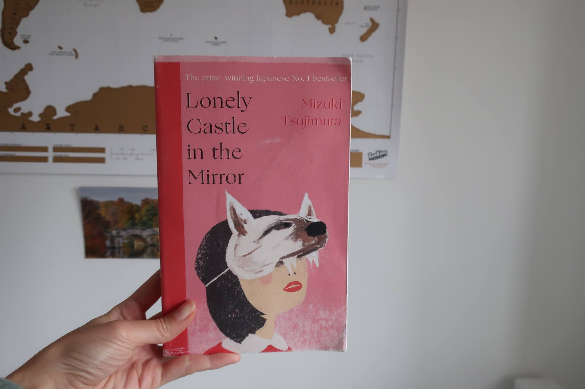

**Does typography have an age?** *The Guest Cat* might sound like a book for children, but the typography tells us that it is in fact a literary fiction book for adults. How can the font of a book title tell us so much? And can we trust our instincts when it comes to judging genres of books based on the typography of the title? Let's find out! 

### Title and design - do they match?

This edition of *The Guest Cat* by Takashi Hirade was published in 2014 by Picador, an imprint of Pan Macmillan. It is a short novel translated from Japanese about a quiet married couple in the suburbs of Tokyo who gets a visit from one of the cats of the neighbourhood. Does the story's premise match the typography on the cover? I think it does.  

It is not a story for children, as one might have presumed if they only *heard* the title without actually seeing the book. If the typography had been handdrawn and a bit more playful, I think a lot of people would have bought it for their kids by mistake. If they didn't do the proper research, that is. So what did the designer do to make it look more adult and sophisticated?

We judge a book by its cover, and its typography, during the first couple of seconds after we lay our eyes on it, and subsequently sort it into one of the boxes of genres and subgenres we have accumulated up through the years, based on our knowledge and prejudices of certain books. The designers in the publishing industry know this, and will use our judgement to their advantage. 

The first words that spring to my mind when I see the cover of *The Guest Cat* are quiet, calm, serious and intellectual. Therefore I unconciously put it in the box named 'literary fiction' in my mind, and I was right. But why did I think that? Well, first of all the title is written in a high-contrast, serifed type that reminds me of Times New Roman, even though it is actually closer to Baskerville. This is a typeface that I associate with newspapers and academic texts, so it gives off the vibe of being important, serious and potentially a little bit boring. Like I would have been glad I read it even though I might not get a lot of joy and pleasure out of it. 

Furthermore, the font is very subtle and calm. There are no surprising elements screaming at you or boldness about it. The title also has a lot of space around it which again contributes to the sense of being a bit serious and intellectual. That is also what literary fiction often is seen as: serious and intellectual. So in that sense it is a perfect match. Although I warn you to fall into the trap of believing all literary fiction is like that, because then you'll be surprised at what you will find. 

### The typefaces of Japan

*The Guest Cat* is a novel translated from Japanese, which pushes into the category of translated literary fiction. I know that a lot of people in the UK find translated fiction intimidating, especially literary fiction, as there is a misconception that it must be very difficult to understand or relate to the story. Fortunately, the sales of translated fiction has grown a lot the last few years, and according to Nielsen Book Scan, the sales of translated literary fiction grew 20% in 2018! This has consequently led to the market for these kinds of books broadening, and the designers can target a wider audience of readers. 

The typography of translated fiction often aims to reflect the country or area of the world it is from in some way or another as it will give the reader a sense of the book as a whole. When you think of Japan, you might think of a futuristic society full of robots, the neon signs in the bustling of Tokyo, anime and sushi. A trend for Japanese fiction is for the typography on the cover to be very sleek and modern, timid and sharp, usually with very low contrast and sans serif typefaces. 

However, Japan is also cherry blossoms, lazy cats in the suburbs and ancient tea ceremonies. This is probably where our *Guest Cat* fits in. The typography can be more traditional with high contrasts and serifs, but still timid and sharp. Another example is *Lonely Castle in the Mirror* by Mizuki Tsujimura which was published by Doubleday in 2021 and designed by Anna Morrison. As you can see in the picture below, the typography of the title is quite similar to *The Guest Cat,* but even thinner and sharper, as if it's a combination of the sleek and modern style and the more traditional one.  

