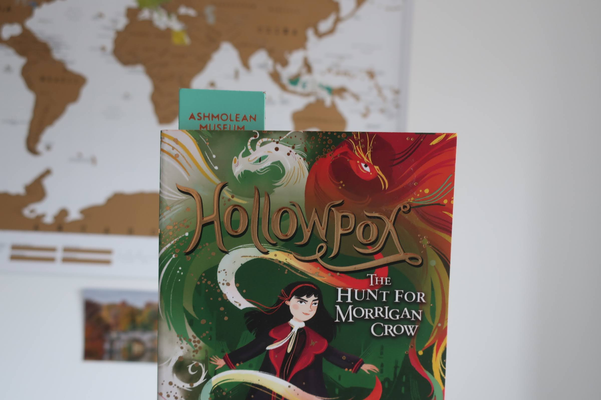
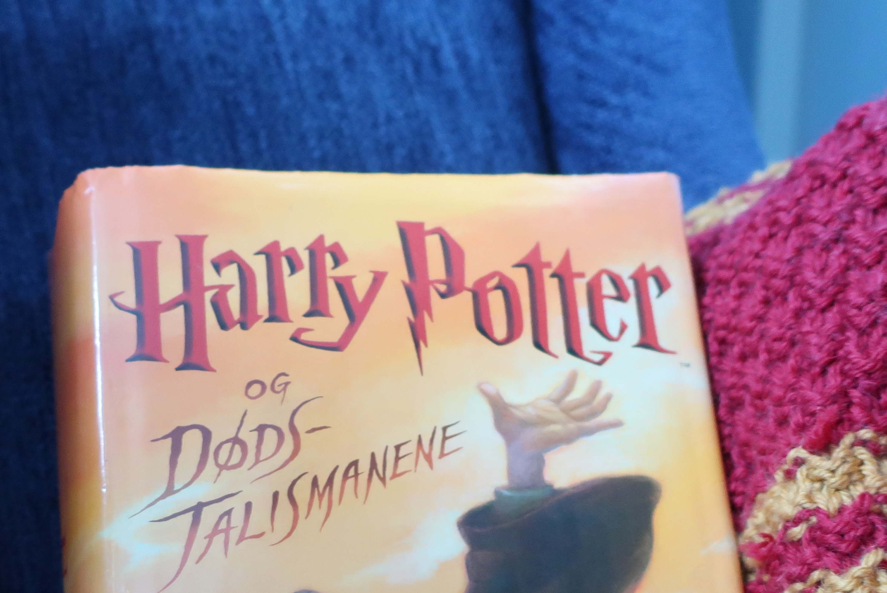
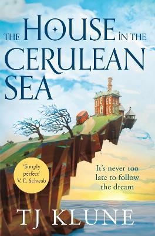

**What does magic look like to you?** Is it bold and blocky? Old fashioned, swirly calligraphy? Straight, sharp lines? Or perhaps something more whimsical, whatever that is.   

### Magic and Wunder

*Hollowpox* by Jessica Townsend is the third book in the *Nevermoor* series, published in 2020 by Orion Children's Books. It is a Middle Grade fantasy novel about Morrigan Crow, a thirteen year old girl who can control Wunder, which basically is another word for magic. She lives in a wonderful city called Nevermoor (heavily inspired by London) full of magic, strange creatures and dangerous alleyways, and is a member of the powerful and secretive Wundrous Society where she learns to use her powers for good. Morrigan is the only Wundersmith known to be alive after the monstrous Ezra Squall tried to take the city a hundred years ago, and must hide her powers in order to not be hunted down and thrown out of the city by paranoid citizens. 

As you get from the description, this is a book where magical elements are very prevalent. It is a very whimsical sort of magic, as the magic in Middle Grade fantasy novels often is. That's why it makes sense to me that the typeface of the title is so swirly and, well, fun! 

### Chaos with a purpose

The baseline of the title is not very straight, which means that the "L"s in "Hollowpox" start below the "O"s. This gives a slightly deranged and chaotic feeling, almost as if the letters are moving. The x-height is quite low, and not very consistent. There are three "O"s in the title, and the last one is much smaller than the other two, probably to make it fit between the "P" and "X" without taking up too much space. This also contributes to the sense of movement and life, because the letters are adapting to each other. 

The voice of the typeface is something of a weird mix I would describe as casual luxury. It's fun and elegant at the same time, which is something that sounds almost a bit contradictory, but here it's done really well in my opinion. Like, you can definetely tell it wasn't a child who drew those letters. They are too well-crafted and deliberate for that. But at the same time they are not as serious and rigid as some of the more "adult" literary fiction novels or academic texts you can find out there. It is snas serif, although some of the letters bend slightly at the top or bottom which can be a bit reminiscent of serifs. That's probably another element that contributes to that slightly luxurious vibe.   

I think the title of "Hollowpox" would in this case be classified as Script, even though it's bolder and more emphatic than ususal Script. It is not as highly contrasted and the letters aren't actually connected as one would usually expect from Script fonts. Therefore it might only be a Script hybrid, with elements of the more classic elements of the Serif typefaces as previously mentioned. 

Not having the letters connected is probably a concious choice the designers made to make it more legible and easier for children to read, as they are the target audience of this book. Therefore it is very important that they don't get the impression that the book isn't for them if they struggle to read the title and basically give up before they have even started. 

### Middle Grade fantasy

The typography is a part of the branding of the series. I'm not completely certain, but it the title's typeface might be created just for the Nevermoor books. Like the typeface of Harry Potter, the most famous book series in the world, and certainly the most famous middle grade fantasy, this is recognisable as the "Morrigan Crow"-font, though it might not be as original and unique as Harry Potter once was, with it's lightning shaped letters. 

However, if you go to the Middle Grade shelves in any bookshop, you will probably find that a lot of Middle Grade fantasy novels have a very similar kind of typeface on their spines and covers. This is perhaps because that kind of style is very popular and trendy in the MG publishing world at the moment. I will not be surprised if in twenty years we can look back on the styling of the title of Hollowpox and say that it was a 

Meanwhile, adult and YA fantasy novels usually get a different kind of typography on their cover. It's usually not meant to be as fun, but rather more dramatic and a bit darker. The reason for this is that they want to reflect the story on the inside which is, unsurprisingly, darker and more dramatic. There is also a general view that fun is for kids and when you are a teenager and adult you are expected to be more interested in more serious issues. 

However, sometimes the typography of a book can confuse people when it doesn't follow the "rules" we expect from certain genres. This is waht happened to the American edition of *The House on the Cerulian Sea* by T. J. Klune. It was an adult fantasy book that was too often classified and shelved as middle grade or children's in bookshops. The cover probably had a lot to do with it, but I also noticed how they changed the typography when they published the UK edition, from playful and "handdrawn" to a much more sophisticated, high-contrasted and serious typeface. This, I think, was to give the cover a more "adult" look, to avoid the confusion about the target audience. 

Can you see why some people thought it was a middle grade fantasy? Even though the UK edition is perhaps more "adult" than the American one, I still prefer the American version aestethically speaking. 

If you would like to see more articles from me where I judge books by their typography, stay tuned!