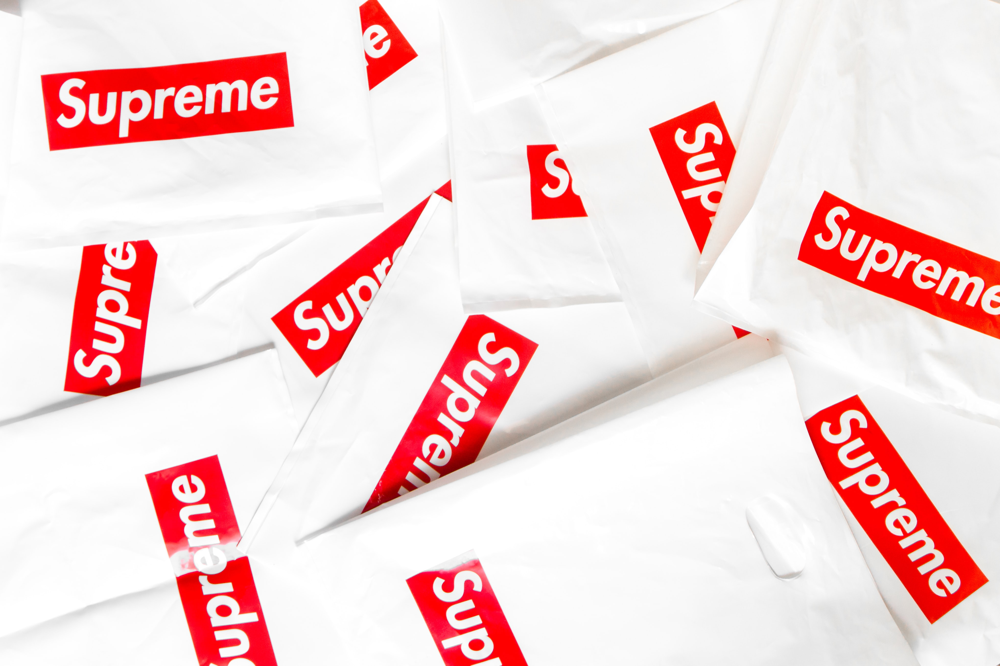

When you think about Jane Austen's universe of balls, sisters, suitors and the English countryside in the early 19th century, you don't usually think  

## Reputation

*Reputation* by Lex Croucher is a historical fiction published in 2021 by Zafre. It's said to be a mix of *Mean Girls* and Jane Austen, a romcom from the Regency-era with great friendships and drunken nights out, perfect for fans of the giant Netflix hit, *Bridgerton*. 

As you can see on the photo above, the title on Reputation is quite bold and rather unexpected. It's very "in your face". It really stands out among the swirly Sript typefaces of the historical fiction genre, especially those who are also categorised as "women's fiction". 

## Bold and modern

Reputation is a historical fiction novel written for the Gen-Z and Millennials, and not typical middle aged people and grandmas (though that depends on your grandma, of course). One could say that even though it's a historical fiction novel, it's very much shaped by today. Written by a non-binary author, with a diverse cast of characters in terms of ethnicity and sexuality, it doesn't seamlessly fit in your typical regency novel shelf. 

This is really reflected in the typeface on the cover. It kind of reminds me of a streetwear fashion brand or even the logo of a toothpaste company. Especially with the shock pink background that makes the white letters stand out even more. The typeface is modern, with low contrasted letters in a slightly leaning itallic font. This will probably appeal more to younger readers as well, who will be intrigued by the unorthodox choice of typography. 

It's similar to the popular Swiss typeface, Helvetica, although the capital "I" does have serifs on this cover. Perhaps becuase the "I" would have been too invisible without it, and that's something this font couldn't dream of being. 

## Bridgerton - a heavy inspiration

Even though *Reputation* might not be very similar to other historical fiction novels design-wise, it certainly plays on its likeness to a certain Netflix success. *Bridgerton* has been viewed by at least 82 million people all over the world, according to The Hollywood Reporter, and as it's also set in Regency era England, I thought it was actually quite clever to make Reputation deliberately matching. Just look at the poster for the TV show, does it ring any bells? 

It's not just the wisterias framing the people posing in the middle, but the styling of the title on the cover of *Reputation* is definitely inspired by *Bridgerton*'s. Bold, low contrasted and modern. The "N"s are sharp, the "O"s are circular, the "R"s look similar, although the "R" in Reputation is a tad bit more condensed I'd say. And of course, the "I" in Bridgerton is unserifed. This is perhaps becuase it wants to look somewhat elegant too, which is not, I think, one of *Reputation*'s main goals. 

Furthermore, the x-height in *Bridgerton* is a bit higher than in *Reputation,* if we were to judge on the "E" and "B". Where the distance to the middle arm in the "E" is identical in *Reputation*, it is slightly longer from the bottom to the middle in *Bridgerton*. In the "B" we can see that the bottom bubble is slightly larger than the top.  This is perhaps to create a bit more interest on *Bridgerton*'s side, because otherwise the type could have been a bit *too* plain and simple. That is perhaps the same reason why they serifed the "I" in *Reputation* too. 

