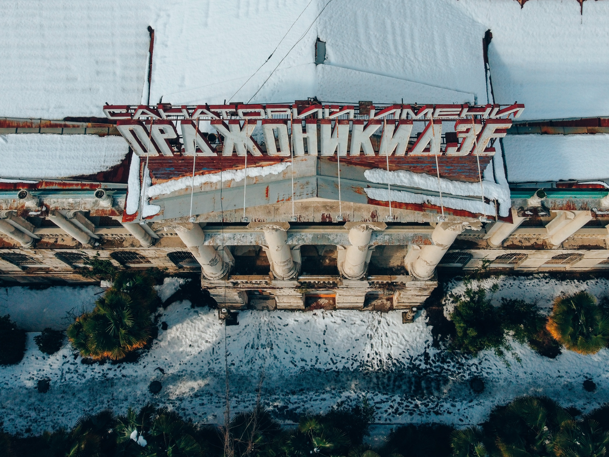
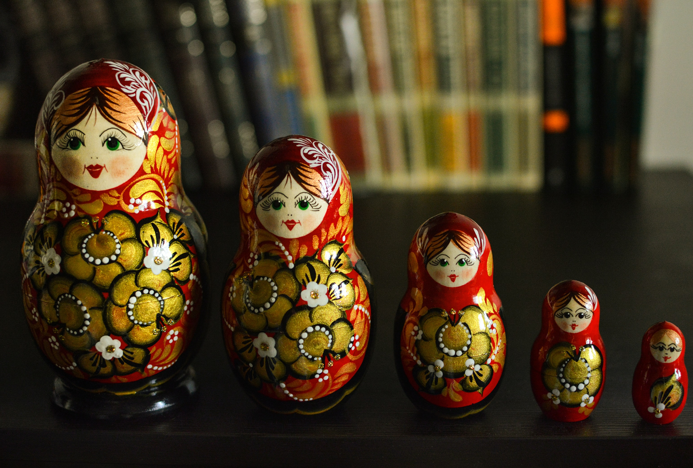

How much has the communist Sovjet era shaped our view of the modern Russian aesthetic? Why do certain typefaces just look Russian? And why do covers of translated books so often try to imitate our perception of the country the book is from? 

### Tsars and Communists

*Other Worlds: Peasants, Pilgrims, Spirits, Saints* is a collection of short stories written by a Russian woman called Teffi. They were origianlly published between 1916 and 1952 and enjoyed by both Tsar Nicholas II and Lenin alike. In 2021 they were finally translated into English and published by Pushkin Press in this short story collection. 

I'd say that the first association that springs to mind when I see this cover is Russia. Partly because of all the red, the vintage vibe and the distinctively Eastern European roof on the house with chicken legs (a reference to an old Russian fairy tale). However, the typography chosen for the title of this cover has undoubtedly a major part in it as well. 

Very tall and condensed, bold, capitals, slopes upwards

Analysis

Translated fiction - try to look like their country

Russia - Sovjet and today

End