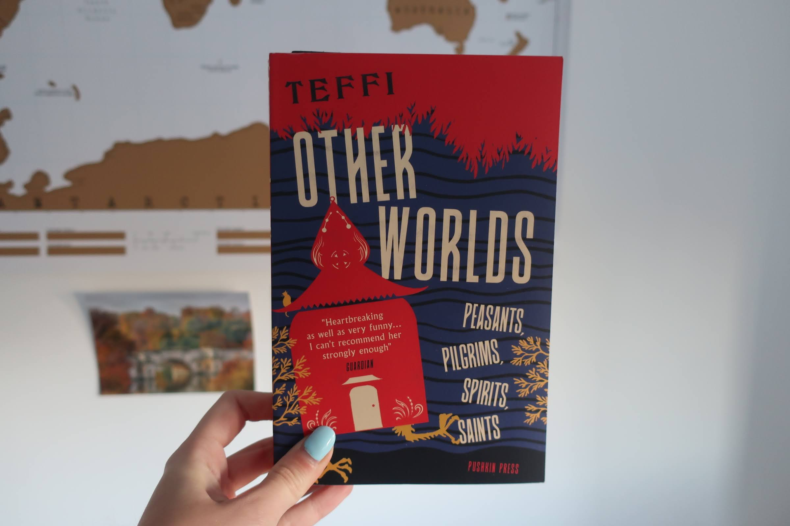

Why do certain typefaces just look Russian? And why do covers of translated books so often try to imitate our perception of the country the book is from? 

### Tsars and Communists

*Other Worlds: Peasants, Pilgrims, Spirits, Saints* is a collection of short stories written by a Russian woman called Teffi. They were origianlly published between 1916 and 1952 and enjoyed by both Tsar Nicholas II and Lenin alike, and in 2021 they were finally translated into English and published by Pushkin Press in this short story collection. 

I'd say that the first association that springs to mind when I see this cover is Russia. And that's not a coincidence. Partly because of all the red, commonly associated with communism and Soviet Russia, the vintage vibe and the distinctively Eastern European roof on the house with chicken legs (a reference to an old Russian fairy tale). However, the typography chosen for the title of this cover has undoubtedly a major part in it as well. 

### An imitation of the Cyrillic alphabet

The typeface consists of very tall and condensed, bold letters, all in capitals. This fits with the Russian stereotypical image of being though, strong and bold. There's nothing timid or soft about it, just like how the Russian government has presented itself the past hundred years. The typeface is very clean which perhaps comes from being a sans serif typeface. No swirls, serifs or unneccessary decorations. 

Furthermore, some of the letters slope upwards instead of going straight across, like in the 'H' and 'R's for example, which makes it look like the Russian or rather the Cyrillic alphabet, in my opinion. The typeface looks kind of similar to the sign on the building pictured above. There's no doubt the designer had Russia in the forefront of their mind every second while designing this cover. 

### A country in the shape of a letter

Something that I have noticed is that a lot of publishers wants the font on the cover of translated fiction try to look like the country or area that the book is originally from. Almost like they want to set the mood. They apply the stereotypical associations when choosing or designing a typeface. So for Russia it's bold, cold and slightly like the Cyrillic letters, while French books often get sleek and elegant fonts, Japan gets either hypermodern or timid serifed fonts, and Sweden gets kind of casual chalk-on-blackboard letters. This does not apply to all translated fiction though, just a fair amount.  

The reason why they do this is probably because they want the book cover to radiate their country of origin to readers who have a special interest in that country or culture. For example, Japanese translated fiction has grown quite a lot the last couple of years and some people will buy a book just because it is from Japan, without really caring about what it's about. Having a stereotypically "Japanese" typeface on the cover can really help make the book stand out to the reader so it's easy to spot and therefore it will sell more. It's a win-win situation, right? 

In many ways, yes. However, some people would argue that using the same sterotypical associations for a country or culture will further amplify the stereotypical view of that culture in general too, and forget the rest. Not all Japanese books, or even Japanese people, are calm and whimsical, not all Russians drink vodka and complain about the dreariness of life in general and oppressive governments. Where are the Russian romcoms? They don't fit the image we have of them here in the UK.